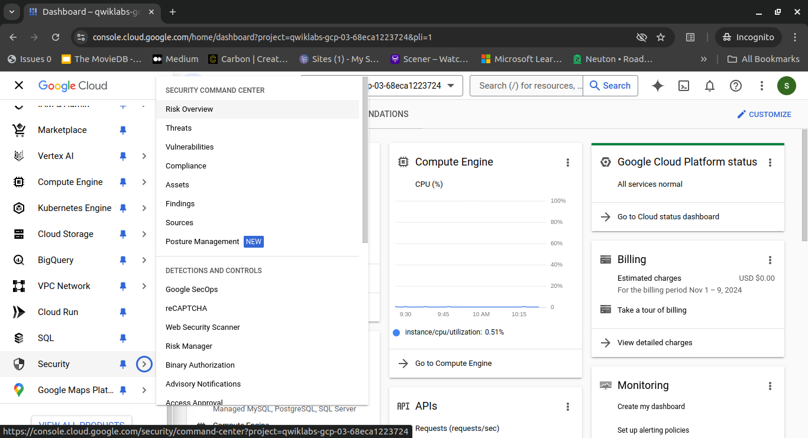
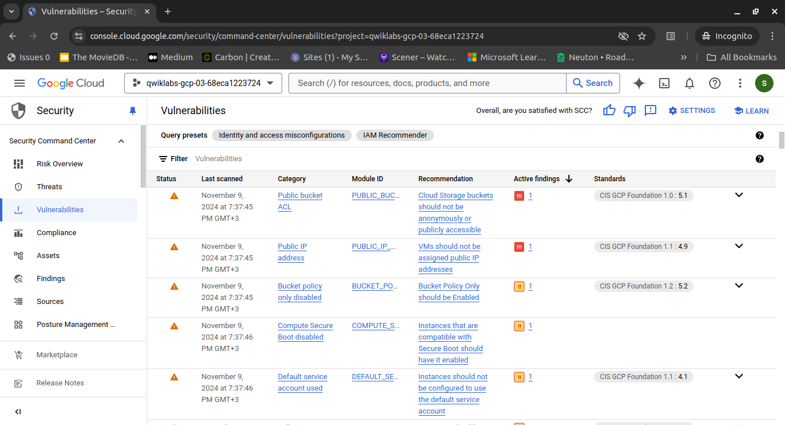
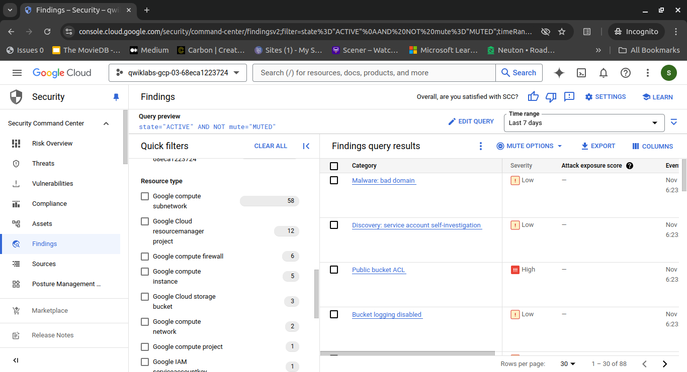
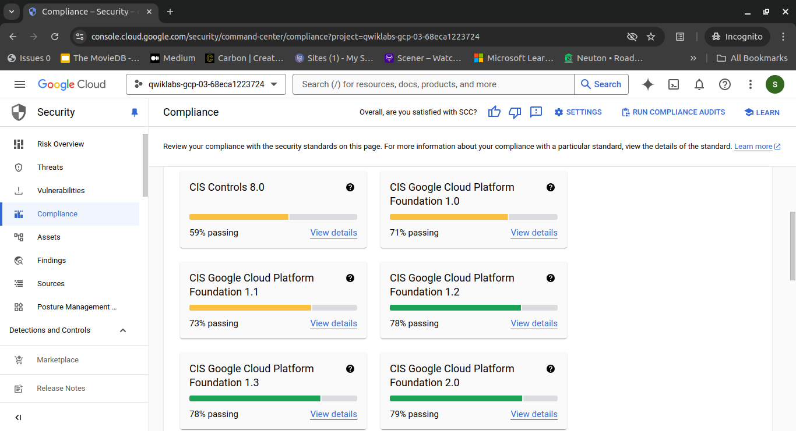
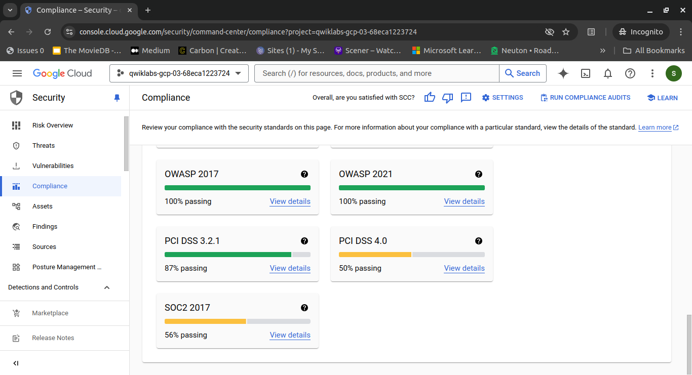
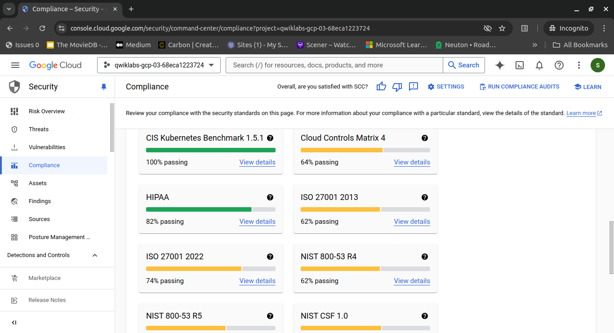
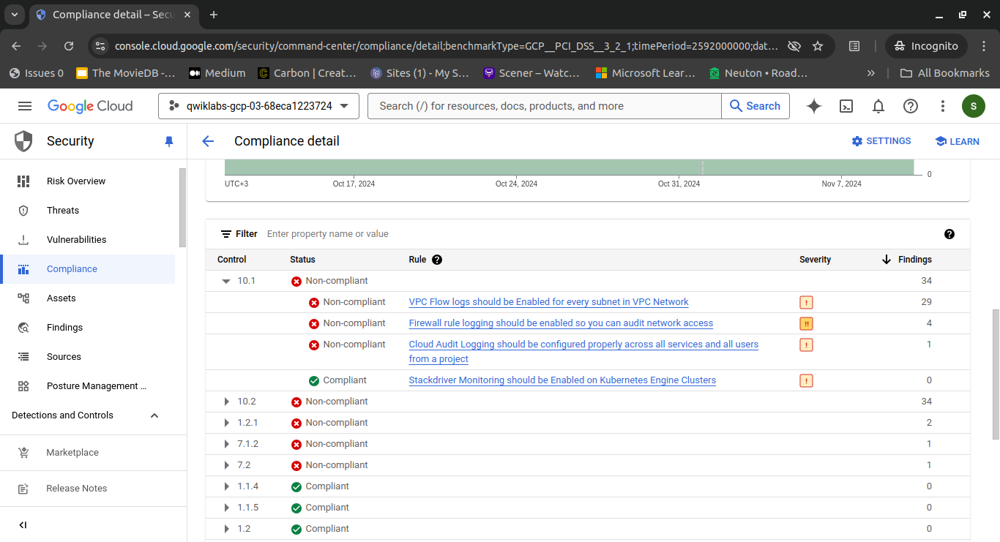
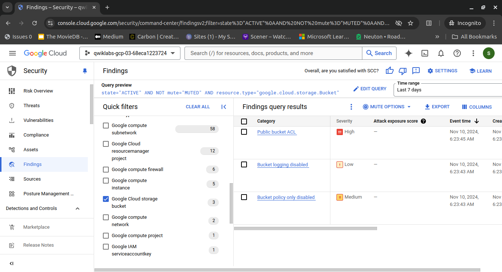
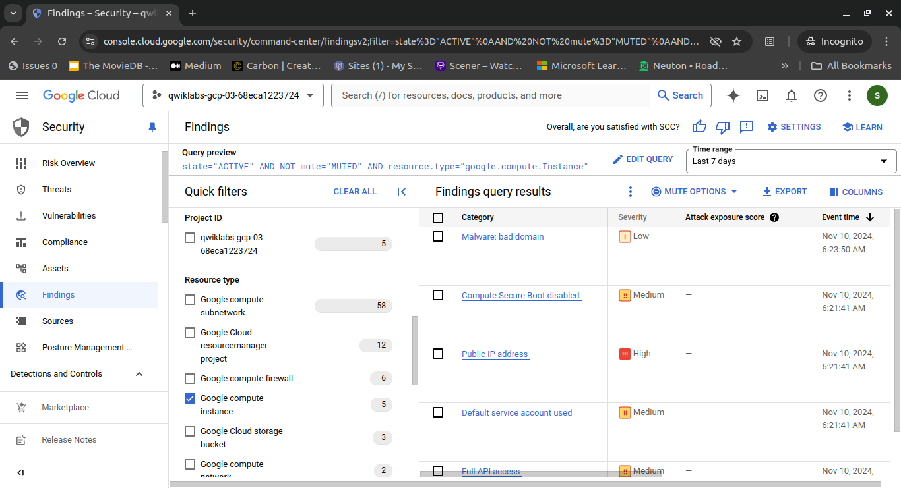
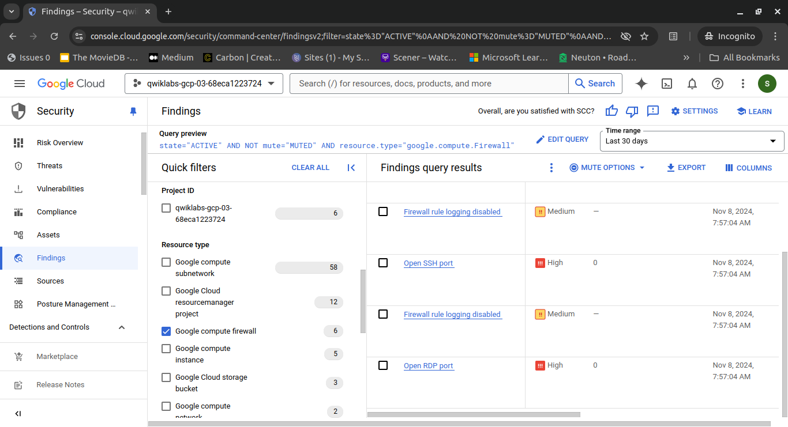

# Step 1 - Analyze the data breach and gather information

The first step towards understanding the scope and impact of this breach is to gather information and analyze the available data.

I will start by examining the vulnerabilities and findings in Google Cloud Security Command Center to determine how the attackers gained access to the data, and which remediation steps to take.

## Steps

1. **Navigate to the Security Command Center**

    First, navigate to the Security Command Center to view an overview of the active vulnerabilities.

    

    In the Google Cloud console, in the Navigation menu, click **Security > Overview**. The Security Command Center Overview page opens.

    Scroll down to **Active vulnerabilities**. This provides an overview of current security vulnerabilities or issues that need attention within the Google Cloud environment.

    

2. **Review Findings by Resource Type**

    Select the **Findings By Resource Type** tab. The security findings or vulnerabilities based on the type of cloud resource affected (e.g., instances, buckets, databases) are organized. By reviewing active vulnerabilities and findings by resource type, I can prioritize and address security issues effectively.

    

3. **Navigate to the PCI DSS Report**

    Next, navigate to the PCI DSS report.

    In the Security Command Center menu, click **Compliance**. The Compliance page opens.

    
    
    

    In the Google Cloud compliance standards section, click **View details** in the PCI DSS 3.2.1 tile. The PCI DSS 3.2.1 report opens.

    

    > **Note:** The Payment Card Industry Data Security Standard (PCI DSS) is a set of security requirements that organizations must follow to protect sensitive cardholder data. As a retail company that accepts and processes credit card payments, Cymbal Retail must also ensure compliance with the PCI DSS requirements to protect cardholder data.

    As I examine the PCI DSS 3.2.1 report, I notice that it lists the rules that are non-compliant, which relate to the data breach.

    Overall, these findings indicate a critical lack of security controls and non-compliance with essential PCI DSS requirements; they also point to the vulnerabilities associated with the data breach.

4. **Filter Findings for Further Examination**

    Next, navigate to the Security Command Center, and filter the findings for further examination and analysis of the vulnerabilities in the Google Cloud environment.

    In the Google Cloud console, in the Navigation menu, click **Security > Findings**. The Findings page opens.

    In the Quick filters panel, in the **Resource Type** section, select the checkbox for the Google Cloud storage bucket resource type.

    

    These findings indicate that the bucket is configured with a combination of security settings that could expose the data to unauthorized access. I will need to remediate these findings by removing the public access control list, disabling public bucket access, and enabling the uniform bucket level access policy.

    In the Quick filters panel, in the **Resource Type** section, uncheck Google Cloud storage bucket, and select the checkbox for the Google compute instance resource type.

    

    These findings indicate the virtual machine was configured in a way that left it very vulnerable to the attack. To remediate these findings, I'll shut the original VM (cc-app-01) down, and create a VM (cc-app-02) using a clean snapshot of the disk. The new VM will have the following settings in place:
    - No compute service account
    - Firewall rule tag for a new rule for controlled SSH access
    - Secure boot enabled
    - Public IP address set to None

    In the **Time range** field, expand the drop-down, and select **Last 30 days**. This will ensure the list includes findings for the last 30 days.

    In the Quick filters panel, in the **Resource Type** section, uncheck Google compute instance, and select the checkbox for the Google compute firewall resource type.

    

    These findings are all listed in the PCI DSS report and highlight a significant security gap in the network's configuration. The lack of restricted access to RDP and SSH ports, coupled with disabled firewall rule logging, makes the network highly vulnerable to unauthorized access attempts and potential data breaches.

    I will need to remediate these by removing the existing firewall overly broad rules, and replacing them with a firewall rule that allows SSH access only from the addresses that are used by Google Cloud's IAP SSH service.
