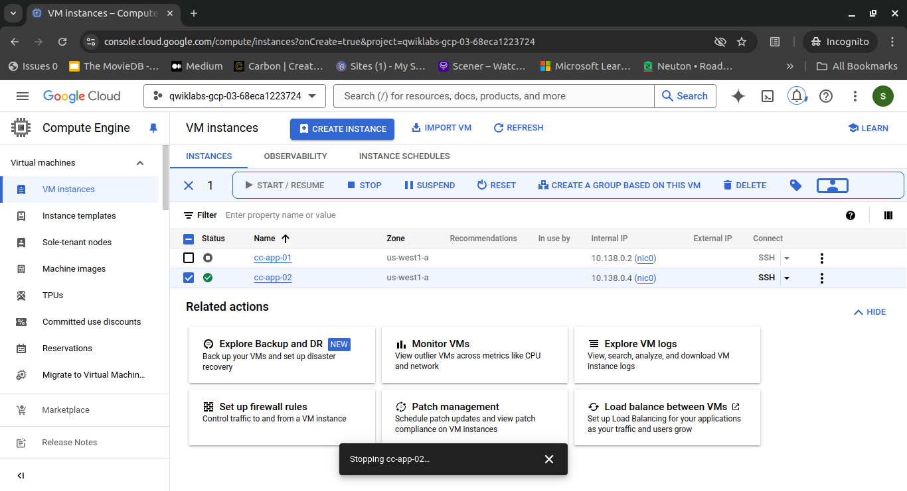

# Step 2: Fix the Compute Engine vulnerabilities

In this step, you will shut down the vulnerable VM `cc-app-01` and create a new VM from a snapshot taken before the malware infection.

> **Note:** VM snapshots are effective in restoring the system to a clean state, ensuring that the new VM will not be infected with the same malware that compromised the original VM.

## Steps

1. In the Google Cloud console, click the **Navigation menu**.
2. Select **Compute Engine > VM instances**. The VM instances page opens.
3. The current VM `cc-app-01` should be listed under VM instances. This is the vulnerable VM that has been compromised and must be shut down.
4. Select the checkbox for the `cc-app-01` VM.
5. Click **Stop**.
6. A pop-up will appear asking you to confirm that the VM should be stopped, click **Stop**.

### Create a New VM from a Snapshot

1. In the action bar, click **+ Create instance**.
2. In the **Name** field, type `cc-app-02`.
3. In the **Machine type** section, expand the drop-down, select **Shared-core**, and then select `e2-medium`.

4. In the **Boot disk** section, click **Change**. The Boot disk dialog opens.
5. Select the **Snapshots** tab.
6. Expand the **Snapshot** drop-down menu, and select `cc-app01-snapshot`.
7. Click **Select**.

8. In the **Identity and API access** section, expand the **Service accounts** drop-down menu, and select `Qwiklabs User Service Account`.

9. Expand the **Advanced options** section.
10. Expand the **Networking** section.
11. In the **Network tags** field, type `cc`. You'll use this tag to apply firewall rules to this specific VM.

12. In the **Network interfaces** section, expand the default network.
13. Expand the **External IPv4 address** drop-down menu, and select **None**.

14. Click **Create**.

> **Note:** You cannot turn on secure boot from here.

The new VM `cc-app-02` should now be created from the `cc-app01-snapshot`. (It may take a few minutes for the new VM to be created.)

### Enable Secure Boot on the New VM

1. Select the checkbox for the `cc-app-02` VM.
2. Click **Stop**.
3. A pop-up will appear asking you to confirm that the VM should be stopped, click **Stop**.
4. Wait for the `cc-app-02` VM to be stopped before you continue.

5. In the VM instances section, click the `cc-app-02` link. The `cc-app-02` page opens.
6. In the `cc-app-02` toolbar, click **Edit**. The Edit `cc-app-02` instance page opens.

7. Scroll down to the **Security and access** section, and under **Shielded VM**, select the checkbox for the **Turn on Secure Boot** option. This will address the Compute secure boot disabled finding.
8. Click **Save**.

9. In the Compute Engine menu, select **VM instances**.
10. Select the checkbox for the `cc-app-02` VM.
11. Click **Start/Resume**.
12. A pop-up will appear asking you to confirm that the VM should be started, click **Start**.

The `cc-app-02` VM instance will restart and the Secure Boot disabled finding will be remediated.

### Delete the Compromised VM

Delete the compromised VM `cc-app-01`.

By following these steps, you have effectively created a new VM from the snapshot, ensuring it is free from malware and misconfigurations. You have also deleted the compromised VM, eliminating the source of the security breach.
