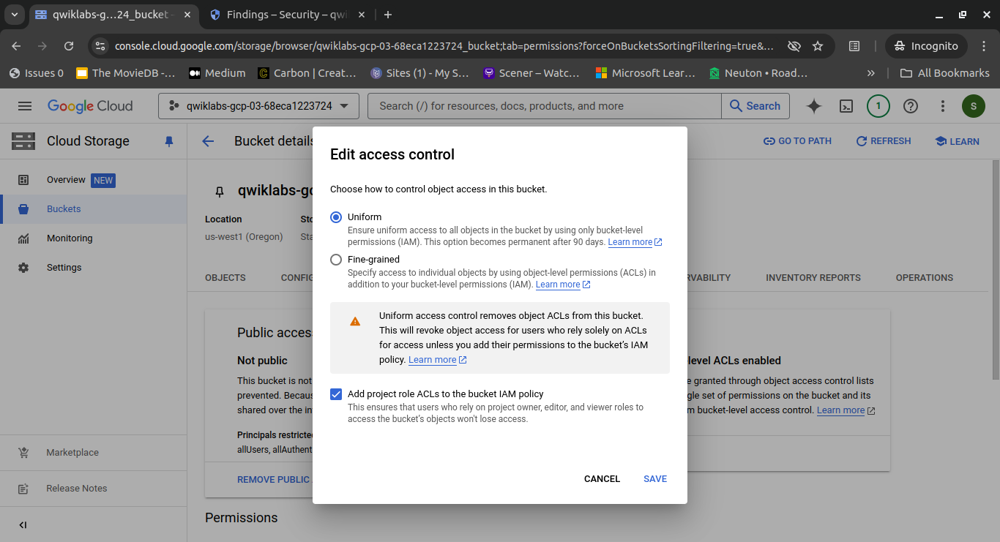

# Step 3. Fix Cloud Storage bucket permissions

In this step, I will revoke public access to the storage bucket and switch to uniform bucket-level access control, significantly reducing the risk of data breaches. By removing all user permissions from the storage bucket, I can prevent unauthorized access to the data stored within.

## Steps

1. In the Navigation menu, select **Cloud Storage > Buckets**. The Buckets page opens.

    

2. Click the `project_id_bucket` storage bucket link. The Bucket details page opens.

    
    

3. Note that there is a `myfile.csv` file in the publicly accessible bucket. This file contains sensitive information that was dumped by a malicious actor. Perform the following steps to address the Public bucket ACL finding:

    - Click the **Permissions** tab.

      

    - In the Public access tile, click **Prevent public access**.

       

    - Click **Confirm**.

4. Switch the access control to uniform and remove permissions for the `allUsers` principals from the storage bucket to enforce a single set of permissions for the bucket and its objects. Ensure that users who rely on basic project roles to access the bucket won't lose their access.

    

By following these steps, I have effectively prevented public access to the bucket, switched to uniform bucket-level access control, and removed all user permissions, addressing the Public bucket ACL, Bucket policy only disabled, and Bucket logging disabled findings.
