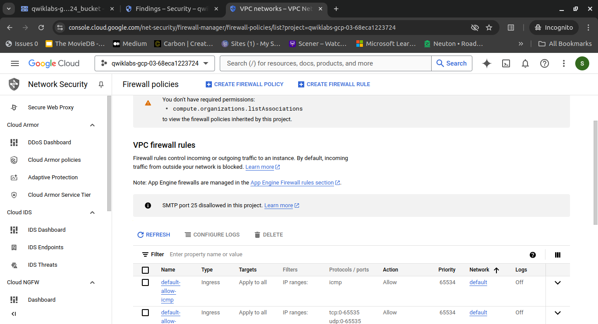
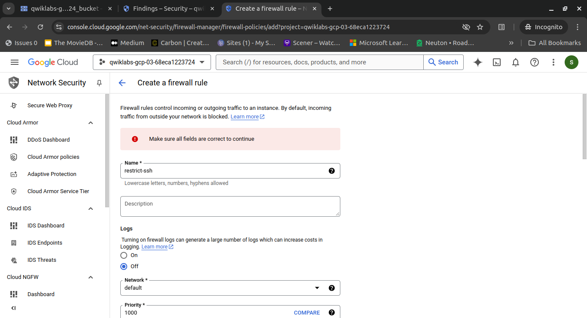
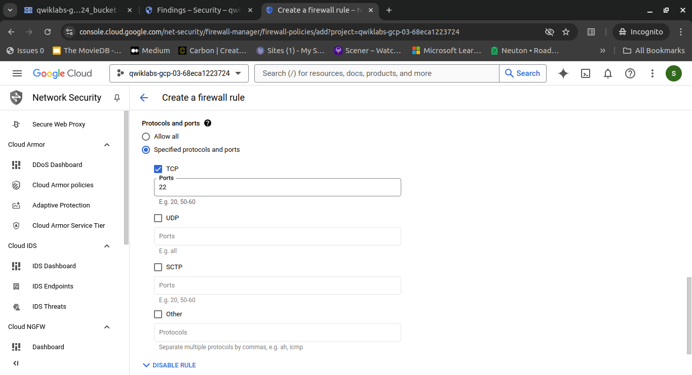
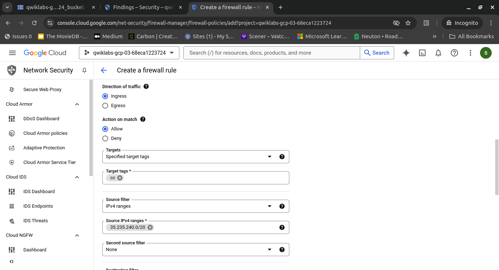

# Step 4: Limit firewall ports access

In this step, we will restrict access to RDP and SSH ports to only authorized source networks to minimize the attack surface and reduce the risk of unauthorized remote access.

> **Note:** Exercise extreme caution before modifying overly permissive firewall rules. These rules may be allowing legitimate traffic, and improperly restricting them could disrupt critical operations.

To maintain uninterrupted management access, create a new, limited-access firewall rule for SSH traffic before removing the existing rule that allows SSH connections from any address.

## Create a New Firewall Rule

This rule must restrict SSH access to only authorized IP addresses from the source network `35.235.240.0/20` to compute instances with the target tag `cc`.

