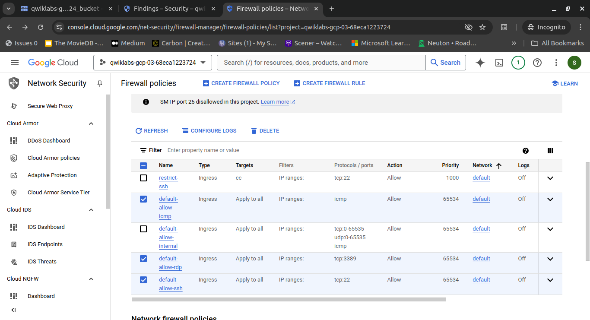
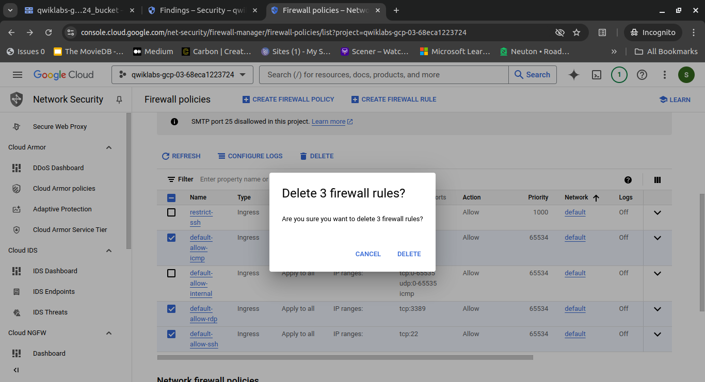
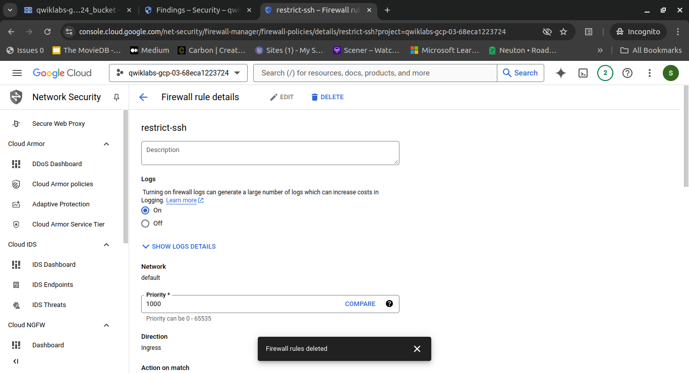
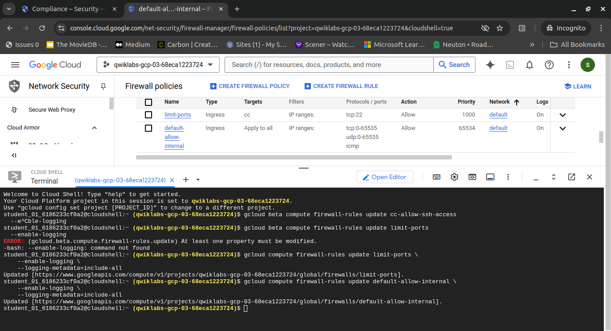

# Step 5: Fix the Firewall Configuration

In this step, we will delete three specific VPC firewall rules that allow unrestricted access to certain network protocols (ICMP, RDP, and SSH) from any source within the VPC network. Afterward, we will enable logging on the remaining firewall rules.

## Deleting Overly Broad Firewall Rules

Delete the following firewall rules to enhance network security:

- `default-allow-icmp`
- `default-allow-rdp`
- `default-allow-ssh`

These rules are overly broad, and removing them will create a more secure and controlled network environment.

By deleting these rules, you restrict access to these protocols, thereby limiting potential unauthorized access attempts and reducing the attack surface of your network.

## Enabling Logging on Remaining Firewall Rules

Enable logging for the following firewall rules:

- `limit-ports` (the rule created in a previous task)
- `default-allow-internal`

Sometimes, the Dashboard may not reflect changes immediately, so it is advised to use the CLI to update changes.

Enabling logging allows you to track and analyze the traffic permitted by these rules, which is likely to be internal traffic between instances within your VPC.
