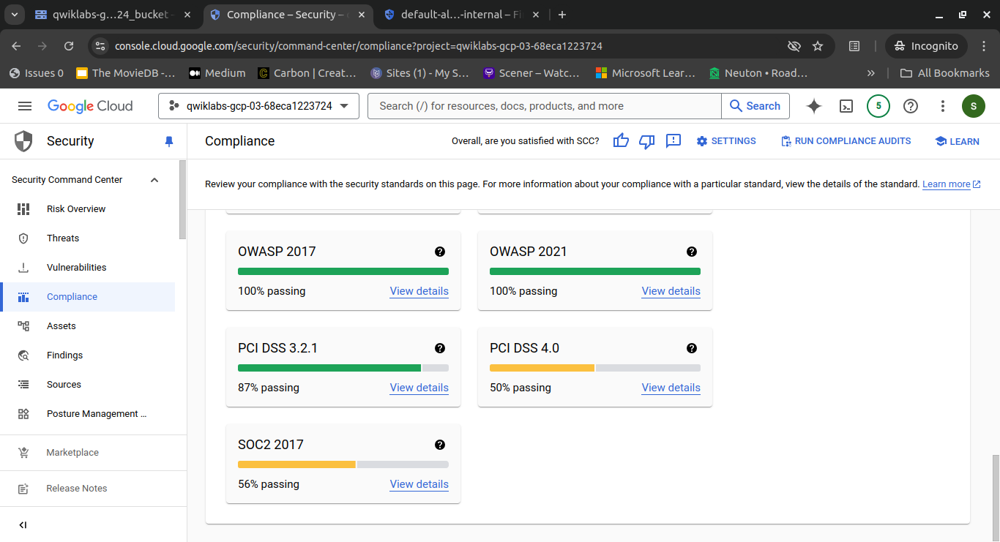
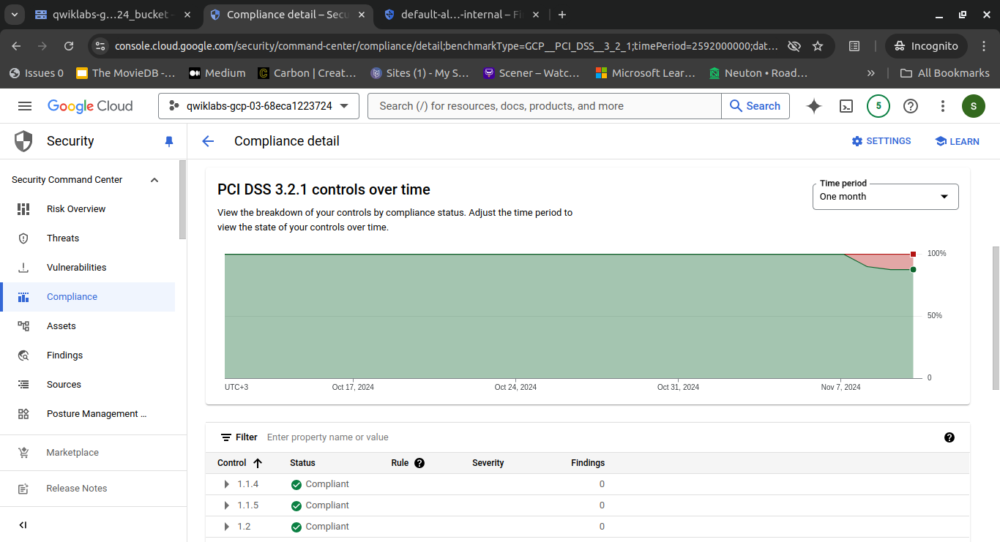

## Step 6: Verify Compliance

After addressing the vulnerabilities identified in the PCI DSS 3.2.1 report, it is essential to verify the effectiveness of the remediation efforts. This step involves running the report again to ensure that the previously identified vulnerabilities have been successfully mitigated and no longer pose a security risk to the environment.

### Instructions:

1. In the Security Command Center menu, click **Compliance**. The Compliance page will open.
   
   

2. In the Google Cloud compliance standards section, click **View details** in the PCI DSS 3.2.1 tile. The PCI DSS 3.2.1 report will open.

3. Click on the **Findings** column to sort the findings and display the active findings at the top of the list.
   
   

4. Verify that all major vulnerabilities are now resolved.
